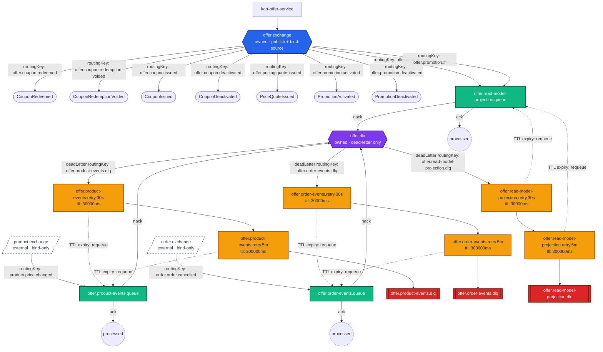

# kart-offer-service — Messaging Flow Diagram

Generated from [`message-bus-manifest.json`](./message-bus-manifest.json). Covers the full lifecycle:
publish fan-out, consume bindings, ack/nack branching, dead-letter routing, retry ladder escalation
(dashed TTL-expiry requeue back to the origin queue), and terminal DLQ parking.

Each exchange is labeled on two independent axes:
- **ownership**: owned by this service vs. external (bind-only, never declared here)
- **role**: publish source, dead-letter exchange (DLX), or bind-only

## Notes

- **`offer.exchange`** is owned and serves two roles at once: it is the publish target for all
  seven domain events emitted via the transactional outbox, *and* a bind-source — this service
  self-consumes its own `offer.coupon.#` / `offer.promotion.#` events on
  `offer.read-model-projection.queue` to keep its MongoDB CQRS read models in sync.
- **`offer.dlx`** is owned but is dead-letter-only — it never carries a published domain event,
  it only receives nacked messages from the three consumer queues and routes them into their
  respective retry ladders / terminal DLQs.
- **`product.exchange`** and **`order.exchange`** are external — bind-only, never declared by this
  service.
- Published domain events (`CouponRedeemed`, `CouponRedemptionVoided`, `CouponIssued`,
  `CouponDeactivated`, `PriceQuoteIssued`, `PromotionActivated`, `PromotionDeactivated`) have no DLQ
  of their own: the outbox relay retries indefinitely until RabbitMQ is reachable rather than
  dead-lettering.
- All three retry ladders share the same two-tier shape (30s, then 5m) and the same `requeueTo`
  target (the originating queue itself); after the 5m tier is exhausted the message parks in that
  queue's terminal DLQ.
